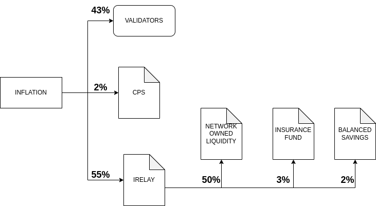
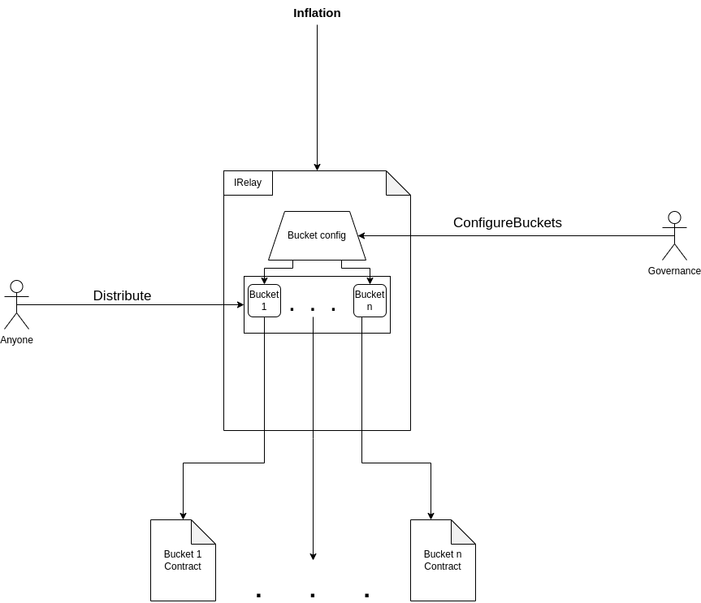

[](https://codecov.io/gh/icon-project/icon-emissions-buckets)

# Introduction
For ICON to be able to manage where to send it inflation in versatile manner it needs a contract which can in a configurable way distribute to many sources.

Goloop can current assign inflation to 3 buckets
* Validator/Staking rewards
* CPS
* IRelay

This IRelay bucket is what this contract aims to fill. Where we have one contract that can relay inflation to any source decided by the network.

## Overview
### ICON inflation flow:


### Buckets Contract Overview:


### Requirements
* The contract has to be owned by ICON Governance
* The contract should have configurable buckets only configurable by the owner of the contract
* The contract should have a public distribution method that distributes the inflation to defined buckets.

# Design

## Storage and Structs
```java
public ArrayDB<Bucket> buckets;

Bucket {
    String name
    Address address
    BigInteger inflationShare
}
```

## Methods

```java
/**
 * Configures the inflations buckets.
 *
 * @param _buckets a list of all buckets for the current configuration.
 */
@External
public void configureBuckets(Bucket[] _buckets) {
    OnlyICONGovernance();
    Assert sum(_buckets.inflationShare) == EXA
    Assert for each (_buckets.inflationShare >= 0)

    buckets.clear();
    buckets.addAll(_buckets);
}
```

```java
/**
 * Distributes inflations to all currently configured buckets
 *
 */
@External
public void distribute() {
    balance = Context.getBalance();
    for each bucket in this.buckets {
        share = bucket.inflationShare * balance / EXA;
        Context.transfer(bucket.address, share);
    }
}
```
# Buckets

## Insurance
[Insurance](insurance/README.md)

## Network Owned liquidity
[Network Owned liquidity](network-owned-liquidity/README.md)


## Savings Rate
[Savings Rate](savings-rate/README.md)
